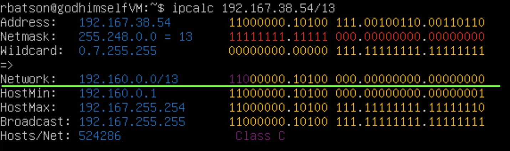
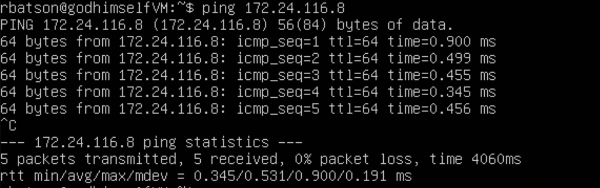
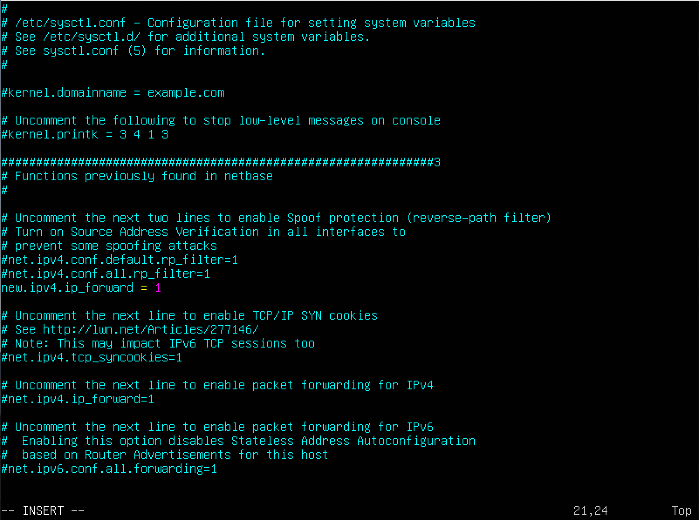
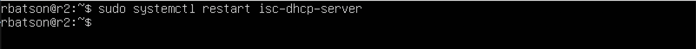

# LinuxNetwork

## `PART 1. Ipcalc`

### 1.1 Сети и маски

-   Адрес сети 192.167.38.54 \

-   Перевод маски 255.255.255.0 в префикстную и двоичную часть \

 
-   /15 в обычную и двоичную \

-   11111111.11111111.11111111.11110000 в обычную и префиксную \

-   Минимальный и максимальный хост в сети 12.167.38.4 при маске /8 \

-   при маске 11111111.11111111.00000000.00000000 \

-   при маске 255.255.254.0 \

-   при маске /4 \

### 1.2 Localhost

#### Можно ли обратиться к приложению, работающему на localhost с данных IP:

Да:

        127.0.0.2
        127.1.0.1
Нет:

        194.34.23.100
        128.0.0.1

### 1.3. Диапазоны и сегменты сетей

#### Какие из перечисленных IP можно использовать в качестве публичного, а какие только в качестве частных:

- 10.0.0.45 - приватный
- 134.43.0.2 - `публичный`
- 192.168.4.2 - приватный
- 172.0.2.1 - `публичный`
- 192.172.0.1 - `публичный`
- 172.68.0.2 - `публичный`
- 172.16.255.255 - приватный
- 10.10.10.10 - приватный
- 192.169.168.1 - `публичный`

#### Какие из перечисленных IP адресов шлюза возможны у сети 10.10.0.0/18: 

- 10.0.0.1 - нет
- 10.10.0.2 - `да`
- 10.10.10.10 - `да`
- 10.10.100.1 - нет
- 10.10.1.255 - `да`

## `PART 2. Статическая маршрутизация между двумя машинами`

Для начала нужно настроить внутреннюю сеть, для этого необходимо, чтобы обе машины (ws1 и ws2) были выключены. В настройках virtualbox заходим в сеть и выбираем адаптер "Внутренняя сеть". Называем как-нибудь эту сеть, например, lan1.

Далее включаем машины и проводим следующие манипуляции:

С помощью команды `ip a` посмотреть существующие сетевые интерфейсы

- lo или local loopback (локальная петля). Служит для подключения по сети к этому же компьютеру и не требует дополнительной настройки;

- enp0s3 - первый сетевой адаптер работающий в NAT режиме.

#### Описать сетевой интерфейс, соответствующий внутренней сети, на обеих машинах и задать следующие адреса и маски:

`ws1 - 192.168.100.10, маска /16`\
`ws2 - 172.24.116.8, маска /12`

    sudo nano /etc/netplan/00-installer-config.yaml

После редактирования подтвердить изменения благодаря 

    sudo netplan apply

#### 2.1 Добавление статического маршрута вручную

Добавить статический маршрут от одной машины до другой и обратно при помощи команды вида ip r add

    sudo ip r add 172.24.116.8 dev enp0s3       //ws1
    sudo ip r add 192.168.100.10 dev enp0s3     //ws2

Далее пингуем

    ping 172.24.116.8       //ws1
    ping 192.168.100.10     //ws2

#### 2.2 Добавление статического маршрута с сохранением

Перезапускаем сеть

    sudo netplan apply

Добавляем статический маршрут от одной машины до другой с помощью файла etc/netplan/00-installer-config.yaml

Да, я перешел с nano на vim, так как такие файлы проще редактировать.

    sudo vim /etc/netplan/00-installer-config.yaml

## `PART 3. Утилита iperf3`

### 3.1 Скорость соединения

##### Перевести и записать в отчёт: 8 Mbps в MB/s, 100 MB/s в Kbps, 1 Gbps в Mbps

    8 Mbps    = 1 MB/s
    100 MB/s  = 800000 Kbps
    1 Gbps    = 1000 Mbps

### 3.2 утилита Iperf3

##### Измерить скорость соединения между ws1 и ws2
Для начала потребуется прописать `iperf3 -s` на `ws1`, чтобы запустить его в роли точки доступа, затем на `ws2` прописываем `iperf3 -c 192.168.100.10` и подключаемся.

## `PART 4. Сетевой экран`

#### 4.1. Утилита **iptables**

Создать файл /etc/firewall.sh, имитирующий фаерволл

- на ws1 применить стратегию когда в начале пишется запрещающее правило, а в конце пишется разрешающее правило (это касается пунктов 4 и 5)
- на ws2 применить стратегию когда в начале пишется разрешающее правило, а в конце пишется запрещающее правило (это касается пунктов 4 и 5)
- открыть на машинах доступ для порта 22 (ssh) и порта 80 (http)
- запретить echo reply (машина не должна "пинговаться”, т.е. должна быть блокировка на OUTPUT)
- разрешить echo reply (машина должна "пинговаться")

- wc1:\
    
- wc2:\
    

        Разница заключается в порядке команд, утилита iptables выполняет первое прочитанное правило, соответсвенно на ws1 будет выполнятся запрет и пинг не пройдет, а на ws2 наоборот, первым стоит ACCEPT, разрешить прохождение пакета, пинг пройдет.

Запустить файлы на обеих машинах командами `chmod +x /etc/firewall.sh` и `/etc/firewall.sh`

#### 4.2. Утилита **nmap**

Nmap (“Network Mapper”) это утилита с открытым исходным кодом для исследования сети и проверки безопасности. Она была разработана для быстрого сканирования больших сетей, хотя прекрасно справляется и с единичными целями. Nmap использует сырые IP пакеты оригинальными способами, чтобы определить какие хосты доступны в сети, какие службы (название приложения и версию) они предлагают, какие операционные системы (и версии ОС) они используют, какие типы пакетных фильтров/брандмауэров используются и еще дюжины других характеристик. В тот время как Nmap обычно используется для проверки безопасности, многие сетевые и системные администраторы находят ее полезной для обычных задач, таких как контролирование структуры сети, управление расписаниями запуска служб и учет времени работы хоста или службы.

- Командой **ping** найти машину, которая не "пингуется", после чего утилитой **nmap** показать, что хост машины запущен

    

## Part 5. Статическая маршрутизация сети

##### Поднять пять виртуальных машин (3 рабочие станции (ws11, ws21, ws22) и 2 роутера (r1, r2))

#### 5.1. Настройка адресов машин

##### Настроить конфигурации машин в *etc/netplan/00-installer-config.yaml* согласно сети на рисунке.

Содержимое файла ../etc/netplan/00-installer-config для каждой из машин, используется расположение как в примере
    

##### Перезапустить сервис сети. Если ошибок нет, то командой `ip -4 a` проверить, что адрес машины задан верно.

- ws11\
    

- ws21\
    

- ws22\
    

- r1\
    

- r2\
    

#### Также пропинговать ws22 с ws21.

#### Аналогично пропинговать r1 с ws11.

#### 5.2. Включение переадресации IP-адресов.
##### Для включения переадресации IP, выполните команду на роутерах:
`sysctl -w net.ipv4.ip_forward=1`

##### Откройте файл */etc/sysctl.conf* и добавьте в него следующую строку:
`net.ipv4.ip_forward = 1`

#### 5.3. Установка маршрута по-умолчанию
##### Настроить маршрут по-умолчанию (шлюз) для рабочих станций. Для этого добавить `gateway4` перед [IP роутера] в файле конфигураций

##### Вызвать `ip r` и показать, что добавился маршрут в таблицу маршрутизации

##### Пропинговать с ws11 роутер r2 и показать на r2, что пинг доходит. Для этого использовать команду:
`tcpdump -tn -i eth1`, в нашем же случае это enp0s8.

#### 5.4. Добавление статических маршрутов
##### Добавить в роутеры r1 и r2 статические маршруты в файле конфигураций.

##### Вызвать `ip r` и показать таблицы с маршрутами на обоих роутерах. 

##### Запустить команды на ws11:
`ip r list 10.10.0.0/18` и `ip r list 0.0.0.0/0`

- Маршрут был выбран отличный, поскольку процесс оценки маршрута в каждом маршрутизаторе использует метод совпадения самого длинного префикса для получения наиболее точного маршрута. Сеть с самой длинной маской подсети или префиксом сети, которая соответсвует целевому ip-адресу, является сетевым шлюзом следующего перехода. Процесс повторяется до тех пор, пока пакет не будет доставлен на хост назначения. Если вкратце, при наличии двух и более маршрутов выбирается маршрут с самой длинной маской т.к. он более точный

#### 5.5. Построение списка маршрутизаторов

##### Запустить на r1 команду дампа:
`tcpdump -tnv -i eth0`
##### При помощи утилиты **traceroute** построить список маршрутизаторов на пути от ws11 до ws21

- Каждый пакет проходит на своем пути определенное количество узлов, пока достигнет своей цели. Причем, каждый пакет имеет свое время жизни. Это количество узлов, которые может пройти пакет перед тем, как он будет уничтожен. Этот параметр записывается в заголовке TTL, каждый маршрутизатор, через который будет проходить пакет уменьшает его на единицу. При TTL=0 пакет уничтожается, а отправителю отсылается сообщение Time Exceeded.Команда traceroute linux использует UDP пакеты. Она отправляет пакет с TTL=1 и смотрит адрес ответившего узла, дальше TTL=2, TTL=3 и так пока не достигнет цели. Каждый раз отправляется по три пакета и для каждого из них измеряется время прохождения. Пакет отправляется на случайный порт, который, скорее всего, не занят. Когда утилита traceroute получает сообщение от целевого узла о том, что порт недоступен трассировка считается завершенной.

#### 5.6. Использование протокола **ICMP** при маршрутизации
##### Запустить на r1 перехват сетевого трафика, проходящего через eth0 с помощью команды:
`tcpdump -n -i eth0 icmp`
##### Пропинговать с ws11 несуществующий IP (например, *10.30.0.111*) с помощью команды:
`ping -c 1 10.30.0.111`

## Part 6. Динамическая настройка IP с помощью **DHCP**
##### Для начала `sudo apt install isc-dhcp-server`, далее для r2 настроить в файле */etc/dhcp/dhcpd.conf* конфигурацию службы **DHCP**:
##### 1) указать адрес маршрутизатора по-умолчанию, DNS-сервер и адрес внутренней сети.
##### 2) в файле *resolv.conf* прописать `nameserver 8.8.8.8.`

##### Перезагрузить службу **DHCP** командой `systemctl restart isc-dhcp-server`.

 
#### Машину ws21 перезагрузить при помощи `reboot` и через `ip a` показать, что она получила адрес.

- Присвоенный ws22 ip адрес входит в тот диапазон dhcp, который мы указали в /etc/dhcp/dhcpd.conf

#### Также пропинговать ws22 с ws21.

##### Для r1 настроить аналогично r2, но сделать выдачу адресов с жесткой привязкой к MAC-адресу (ws11). Провести аналогичные тесты

## Part 7. **NAT**

##### В файле */etc/apache2/ports.conf* на ws22 и r1 изменить строку `Listen 80` на `Listen 0.0.0.0:80`, то есть сделать сервер Apache2 общедоступным

##### Запустить веб-сервер Apache командой `service apache2 start` на ws22 и r1

##### Добавить в фаервол, созданный по аналогии с фаерволом из Части 4, на r2 следующие правила:
##### 1) Удаление правил в таблице filter - `iptables -F`
##### 2) Удаление правил в таблице "NAT" - `iptables -F -t nat`
##### 3) Отбрасывать все маршрутизируемые пакеты - `iptables --policy FORWARD DROP`

- Пинг не проходит
    

- Добавляем еще одно правило для пропуска icmp
    

- После добавления правила, разрешающего icmp, пинг с ws22 проходит до r1
    

- Включаем snat, dnat, добавляем правило, которое разрешает tcp
    

- Коннектимся к r1 через telnet на ws22 (проверка SNAT)
    

## Part 8. Дополнительно. Знакомство с **SSH Tunnels**

- Меняем в /etc/apache2/ports.conf порт на local
    

- Запускаем apache на ws22 с новыми настройками
        sudo service apache2 start

- Проверка работы сервера
    
    

- Команды необходимые для выполнения:

        1. service apache2 start - запуск сервера на ws22

        2. ssh -L 8080:10.20.0.20:80 rbatson@localhost - доступ с ws21 к серверу на ws22

        3. ssh -R 8080:10.20.0.20:80 rbatson@localhost - доступ с ws21 к серверу на ws22

        4. telnet 127.0.0.1 8080 - проверка подключения

- Проверка подключения через telnet
    
